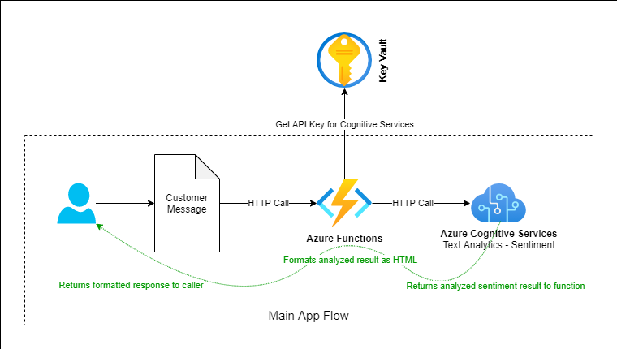
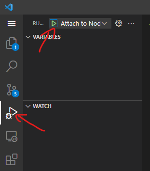
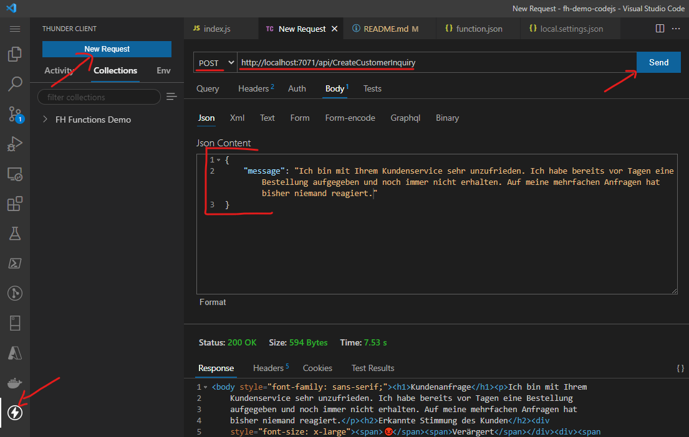
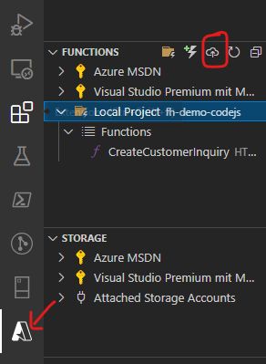
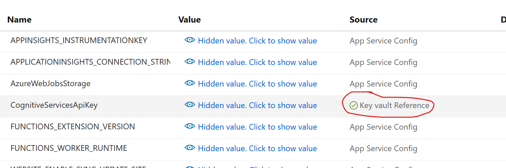
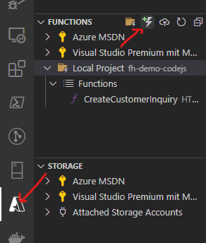

# Demo Project Azure Functions: Customer Inquiry Sentiment

This small sample project demonstrates how to implement a very basic Azure Function on the local development environment and how to deploy it to the cloud.

An Azure Function is a piece of code that can be executed in a managed cloud environment without having to worry about any further details about hosting, scaling, reliability or any kind of infrastructure - Azure Functions is a so-called "serverless" computing platform.

To learn more about Azure Functions, go [here](https://docs.microsoft.com/en-us/azure/azure-functions/functions-overview)

## General Idea

The general idea of this function is to take a customer support message over a HTTP API call and analyze the sentiment of this message - if the language used is positive, neutral or negative. For that, Azure Cognitive Services are used, a service that offers out-of-the-box AI and Machine Learning services for general purpose scenarios.

The customer message is then returned to the caller as a formatted HTML document, including a visual information about the sentiment of the message.

## What this example demonstrates

* Setting up a local development environment for Azure Functions with:
  * node.js
  * Local Azure Functions runtime
  * Visual Studio Code
  * Azure & Azure Functions extension for Visual Studio Code
* Writing a very basic Azure Function wit node.js/Javascript
* Calling another HTTP/REST service out of an Azure Function to do someting meaningful in this demo (Azure Cognitive Services)
* How to handle secrets in Azure with Azure KeyVault & Managed Identities



After that, you might want to experiment yourself and try to extend this sample with a few of your own functions.

## Prerequisites

> * As your Code Editor, install [Visual Studio Code](https://code.visualstudio.com/)
>   * In Visual Studio Code, install the **Azure Tools** extension. It will allow you to create local function projects and publish them to Azure. Just install the whole extension, don't bother with the possibility to install individual modules. You can learn more about the extension and also install it directly from the browser [here](https://marketplace.visualstudio.com/items?itemName=ms-vscode.vscode-node-azure-pack)
> * Install node.js as your development/runtime environment, it allows you to write Azure Functions with JavaScript. Find it [here](https://nodejs.org) and use the latest LTS version
> * To develop and run functions on your local machine, we can actually install the full Azure Functions runtime on your device. It's named **Azure Functions Core Tools** and you can learn all about it [here](https://docs.microsoft.com/en-us/azure/azure-functions/functions-run-local?tabs=v3%2Cwindows%2Ccsharp%2Cportal%2Cbash%2Ckeda). On this page, you'll also find a download/install instructions for various operating systems. If you're on Windows, you can also simply use [this direct download link](https://go.microsoft.com/fwlink/?linkid=2135274).

## Run the project locally

### Open the demo project in Visual Studio Code

In Visual Studio Code, go to `File > Open Folder ...` and open the folder where you have cloned this repository or copied the files to from the downloaded ZIP file.

Have a quick look at the files in the project: Our function is called `CreateCustomerInquiry` and it has it's own folder. Below that you will find:

> * `function.json` - the configuration file for this function
> * `index.js` - the code that gets called when the function is triggered
> * `sample.dat` - a sample request that can be used in the portal to test the function

Keep in mind that Azure Functions are structured in the **Functions App** which is a host for multiple individual **functions**. If you create a 2nd function in this project, it will be grouped into the same **Functions App**.

If you look into `function.json` you will see the `bindings` configuration. Each function has at least one input and output binding and it tells you (or lets you configure) what triggers the function to execute and what happens when the execution is finished:

```json
{
  "bindings": [
    {
      "authLevel": "anonymous",
      "type": "httpTrigger",
      "direction": "in",
      "name": "req",
      "methods": [
        "get",
        "post"
      ]
    },
    {
      "type": "http",
      "direction": "out",
      "name": "res"
    }
  ]
}
```

We can see here that this function has an input trigger of type `httpTrigger` - that means that a HTTP request to the endpoint of the function triggers it's execution. The 2nd block is the output binding, which again is of type `http` - so it means after the execution is finished, a response will be sent out over HTTP.

Functions can have a lot of different bindings to other sources - like databases or event sources that trigger their execution. But for now, we will only focus on HTTP.

### Setup Azure Cognitive Services resource and add the API Key to your code

For this sample we want to use **Azure Cognitive Services** APIs that offer nice, useful and easy to use machine learning services. It's just for the sake of a more interesting demo and also to show how to integrate with other Azure services.

However, to use it you have to create a Cognitive Services resource in your Azure Subscription that will also get you an API Key that you will need to call & authenticate against the service:

> * Got to `Home` on your [Azure Portal](https://portal.azure.com) and click on `Create a resource`
> * In the search box, tpye `Cognitive Services` and select it from the results
> * On the next screen, click the blue `Create` button
> * Now fill the 'Create Cognitvie Services' form:
>   * *Subscription*: select your subscription
>   * *Resource group*: used to group multiple resources together, for example all resources that are used by the same application. If you have one that fits, select a pre-existing one. Else create a new one and choose a meaningful name, maybe `Functions Demo Resources`
>   * *Region*: Choose `West Europe` or any other region in Europe
>   * *Name*: Choose a meaningful name but be aware that the name must be globally unique. For example `FunctionsDemoCognitiveServices[YourFirstName]`
>   * *Pricing tier*: Select the `Free` tier. You'll have plenty of free requests avaialble with that subscription. Do not select the Standard tier, you'll be billed per request on that one.
>   * Click the blue button `Review and create`
> * Click the blue button `Create`
> * Wait for the deplyoment to be complete and then click the blue button `Go to resource`

You should land on a quickstart page that offers you a good starting point to explore,  learn and quickyl try out Cognitive Services. It's not necessary for this demo though.

What you will need is your **API Key**. We will need this to call the service from our code. Under 1) in the Quickstart, click on `API Key` (or alterantively, you'll also find `Keys and Endpoint` on the left-side menu) - you'll need any one of those keys.

Also relevant is the URI that is found under `Endpoint`. This is the URI where you can reach your personal instance of Cognitive Services.

Now go to Visual Studio Code and in your project, find and open the file `local.settings.json`. It will look like this:

```json
{
  "IsEncrypted": false,
  "Values": {
    "AzureWebJobsStorage": "",
    "FUNCTIONS_WORKER_RUNTIME": "node",
    "CognitiveServicesApiKey": "<Paste Cognitive Services API key here>",
    "CognitiveServicesEndpointUri": "<Paste Cognitive Services Endpoint URI here>"
  }
}
```

Under `Values`, you find `CognitvieServicesApiKey` and `CognitiveServicesEndpointUri` - overwrite the existing placeholder texts in the values with your API key and endpoint URI.

Each key/value pair under `Values` will be available as an environment variable at the runtime of your app on your local machine. You can see where the code reads this information from the environment variables in the file `CreateCustomerInquiry/index.js` in the main function line 7 and 8:

```js
  // Gets Cognitive Services API Key from Environment Variables. While developing on your local machine, this is read from local.settings.json
  const cognitiveServicesApiKey = process.env["CognitiveServicesApiKey"];
  const cognitiveServicesEndpointUri = process.env["CognitiveServicesEndpointUri"];
```

### Now run the project

That's all we need to get this running on your *local* machine. In Visual Studio Code you find the Run & Debug menu on the left-side menu and after opening that, just press the green arrow on top. Or simply press F5.



The Azure Function can now simply be called in the browser by opening the following URI that contains a customer complaint in the query parameter `message`:

[http://localhost:7071/api/CreateCustomerInquiry?message=**Ich möchte mich über Ihr Kundenservice beschweren.**](http://localhost:7071/api/CreateCustomerInquiry?message=Ich%20möchte%20mich%20über%20Ihr%20Kundenservice%20beschweren.)

### Optional: Testen mit POST Request

To send a `POST`-Request as JSON in the body to the Azure Function, tools like [Postman](https://www.postman.com/) or the Visual Studio Extension [Thunderclient](https://marketplace.visualstudio.com/items?itemName=rangav.vscode-thunder-client) - can be used, the latter is installed quicker and without a forced registration. After installing the extension, you can send a request like this:



## Deploy and run in the cloud

Now that we were able to exectue & test this project locally, we want to deploy it to the cloud.

### Create Function App & deploy

You could create a function app manually in the Azure Portal, but the Azure Tools extension for Visual Studio Code can do this right away and way quicker. You should have installed the extension in the *Prerequisites* section of this document.

You find the Azure Tools in the left-hand menu unter the Azure A-Logo.



After opening it, you can see expandable areas for the different supported Azure services on the right. Expand the FUNCTIONS area. You'll see your local project listed there. Click on the little cloud icon that says `Deploy to Function App ...` when you hover over it.

You will be guided through the deployment by selecting items over the Command Palette bar in Visual Studio Code. These are the steps:

> * *Select Subscription*: Select your subscription (click on it or navigate with the keyboard and press ENTER)
> * *Select Function App in Azure*: **BE CAREFUL HERE! We want to use `Create new Function App in Azure` but there are two with the same name. Notice one has a small `Advanced` text behind it. Use this one as only with this, we get all the options like choosing a resource group!**
> * *Enter a globally unique name*: Choose a meaningful name, for example `FunctionsDemoCognitiveServices[YourFirstName]`
> * *Select a runtime stack*: Below `Node.js`, select `Node.js 14 LTS`
> * *Select an OS*: Choose `Linux`
> * *Select a resource group*: Here we want to re-use the resource group you created earlier when creating the Cognitive Services resource. It should appear in the list. Select it.
> * *Select a location*: Select `West Europe` or any other location in Europe
> * *Select a hosting plan*: Choose `Consumption`
> * *Select a storage account*: Choose to create a new one and after that, acceppt the suggested name that is identical to the name you entered for your Functions App by simply pressing ENTER.
> * *Select an Application Insights resource*: Select `Skip for now`

Provisioning of your resources will start immediately and you will be informend when it is finished. You can now open the Azure Portal and check if you find your Functions App and everything is as expected.

### Secret handling in the cloud with Azure KeyVault

The function is now running and you can navigate to it in the Azure Portal and try to test it. You find it by going to the resource group you created and selecting the Functions App there. In the left-hand menu you'll find the `Functions` menu entry and after clicking on it, you should see the `CreateCustomerInquiry` function. Click on it to open it and try to test it, directly in the portal or by clicking on `Get function URL` (top menu bar) and open it in the browser or with ThunderClient.

You'll notice that it executes, but fails. This is expected.

We are calling Cognitive Services, but we have only configured the URI of the Cognitive Services endpoint and the API Key we need to send with it in the local development environment. The `local.settings.json` file where we entered this information, as it's name suggests, never gets deployed to the cloud. And for good reason: our API key is a secret like a password. Anyone who gets a hold of it can call *our* Cognitive Services instance - and cause costs on our account. We do not want to save this anywhere where other people could easily access it.

So what do we do? First of all, we know that our code wants to get the endpoint URI and the secret API Key from an environment variable. So we need to put this information there, but in a secure way. In the portal, go to your functions app and in the left menu in the `Settings` section you will find `Configuration`.

You will see a list of Name/Value pairs under Application Settings. Those will be exposed as Environment Variables to our functions. Exactly what we need. Create two new application settings and name them exactly like in the `local.settings.json` file:

| Name                           | Value                                                                      |
| -------------------------------|--------------------------------------------------------------------------- |
| `CognitiveServicesApiKey`      | leave empty for now!                                                       |
| `CognitiveServicesEndpointUri` | Endpoint URI for your Cognitive Services, same as in `local.settings.json` |

While those settings are encrypted at rest, they're still not safe enough for secrets. Anybody with access to your app could see them! Luckily, Azure has a safe store exactly for those needs: **KeyVault**. KeyVault is a safe store for secrets like passwords, keys, certificates, private keys and others.

Let's create one: on your Portal Home, click on `Create resrouce` and search for `Key Vault`. Select it from the results and click `Create`. Choose your subscription and use the same resource group you already used for your Cognitive Service and Function App. Also choose a menaingful name again, the same region you used for the other services and finally, sleect `Standard` as the pricing tier. Be aware that KeyVault is not free and charges a very small amount of a few cents per 10.000 transactions.

Leave the rest as is and click `Review + create` and then `Create` again. Open the KeyVault when it's finished provisioning.

On the left-hand menu you'll see we have several options for keys, secrets or certificates. Our API Key is a secret, so open that. Enter:

> * *Upload options*: Manual
> * *Name*: CognitiveServicesApiKey
> * *Value*: Enter your Cognitive Services API Key

Leave the rest as is and click create.

To query the KeyVault for this secret, we need an identifier (ID). It's a simple URI and we can find it in the properties of the secret now that it has been created:

> * In the secrets list you should see now, click on your just created secret
> * Secrets are versioned, so now you see a list of available versions. It's just one now, so click on this version.
> * There you find the `Secret Identifier` - it's an URL which is nice as it's very clear what this ID represents. Copy the value as we will need it shortly in the next section.

To learn more about Azure KeyVault, go [here](https://docs.microsoft.com/en-us/azure/key-vault/general/basic-concepts)

### Managed identities for easy & secure service-to-service authentication

One last puzzle piece is missing: how do we authenticate from our Functions App against the KeyVault so we can actually *retrieve* the secret from there? If we would need another secret like a KeyVault API Key or username/password, we'd just have shifted the issue from one secret to the other.

Lucikly, KeyVault supports Azure Managed Identities. Most services you create in Azure can have a managed identity and can be authenticated by other services by this identity. As the name "managed" suggests, Azure takes care of all the heavy lifting and the authentication happens, managed by Azure, entirely in the background. All we need to do is to enable a Managed Identity on our Functions App:

> * Open the functions app in the portal
> * On the left-side menu, under the `Settings` section, click on `Identity`
> * Switch the `Status` toggle to `On`
> * Click `Save`

Now this Managed Identity of our Functions App needs access rights to the secret in our KeyVault. So go back to the KeyVault and in the left-hand menu under the section `Settings`, click on `Access policies`. In the middle of the page is a link called `+ Add Access Policy` - use it. Now:

> * Under `Secret permissions` open the dropdown and select `Get` and `List`. That's all our Functions App will need, it should not have any write access to the vault secrets.
> * We also do not need access to Keys or Certificates, so we leave those fields empty.
> * Next to `Select principal`, click on `None selected`
> * In the opening search window, enter the name of your Function App - select it and click on the blue button `Select`
> * Click `Add`
> * That's it, our Functions App has now access to the KeyVault secrets

To learn more about Managed Identities, go [here](https://docs.microsoft.com/en-us/azure/active-directory/managed-identities-azure-resources/overview).

### Add KeyVault reference to our environment variable

We have created the secret in the KeyVault and we are now able to access it as we have enabled access to the KeyVault for our functions app via Managed Identities. What's left is that we need to get this secret into the environment variable in the Function App that we created earlier as our code queries those environment variables.

It's quite easy to do. Go to your Functions App and as earlier when we created the environment variables, on the left-side menu in the `Settings` section, go to `Configuration`. There you should find both earlier created AppSettings `CognitiveServicesApiKey` and `CognitiveServicesEndpointUri` which, as discussed earlier, are exposed to the function at runtime as environment variables.

> * Click on edit for the setting `CognitiveServicesApiKey`
> * Now you can enter the value. We can define that the value is queried from the **KeyVault** by using a special query syntax for the value:
>
>> @Microsoft.KeyVault(SecretUri=**\<Your KeyVault Identifier\>**)
>
> * Replace the text **\<Your KeyVault Identifier\>** with the Secret Identifier URI you copied in the last section from the KeyVault Secret properties. It should look like this:
>
>> @Microsoft.KeyVault(SecretUri=`https://yourkeyvaultname.azure.net/secrets/CognitiveServicesApiKey/9xxx0165d08047xxxxxb5ac59f92xxx3`)
>
> * Click `OK`
> * Click `Save`

Notice that this key now has a different Source than the other keys - it shows you the value is coming from the KeyVault. It should have a green checkmark. If there is a red X instead, click on edit for this setting and you should see the error message why the KeyVault can't be queried.



That's it ... with just a bit of configuration, we have a safe way to store secrets and access them from our code- You can now test your function again and it should work fine.

## Add another function to the project

Now you should practice developing Azure Functions and extend your project with additional functions. You could write a string concatenator function that concatenates all passed parameters or simple math fucntions that sum two passed number parameters.

Or go directly into the action and try to setup an API for your application that for now might just return mocked data.

The Azure Tools in Visual Studio Code can help you to add a new function to your project. After opening the Azure Tools from the left menu, simply click on the `New function` icon:



Then just choose HTTP Trigger again and give the function a meaningful name. It will create a new folder with all needed files below it for the new function.

After you developed and tested the function locally, don't forget to also deploy it to the cloud afterwards.
